# ⚔️ ExtraSwords – Minecraft 1.7.10

**ExtraSwords** é um mod para **Minecraft 1.7.10** que adiciona **8 espadas elementais**, cada uma com um efeito único.  
O foco é expandir o combate com mecânicas simples e visuais que se integram perfeitamente ao estilo vanilla do jogo.

---

## 📦 Espadas

### 🔥 Fire Sword
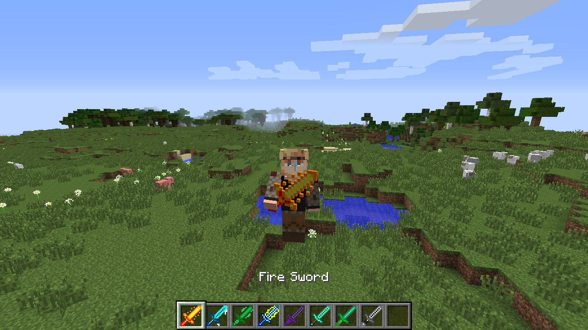

**Efeito:** Causa combustão no inimigo por alguns segundos.

---

### ❄️ Ice Sword

**Efeito:** Reduz a velocidade de movimento do inimigo.

---

### 🧪 Poison Sword
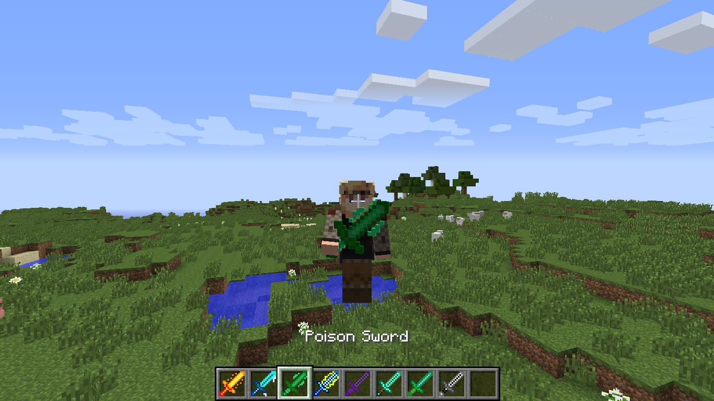

**Efeito:** Aplica veneno no alvo por alguns segundos.

---

### ⚡ Lightning Sword
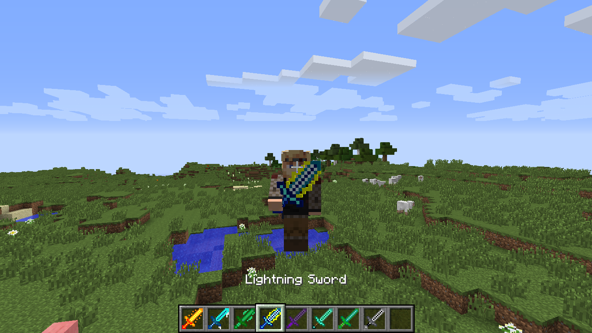

**Efeito:** Invoca um raio sobre o inimigo ao acertar.

---

### 💀 Wither Sword
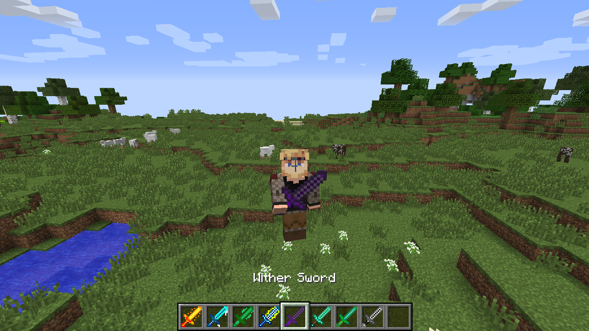

**Efeito:** Aplica o efeito Wither, causando dano ao longo do tempo.

---

### 🤢 Nausea Sword
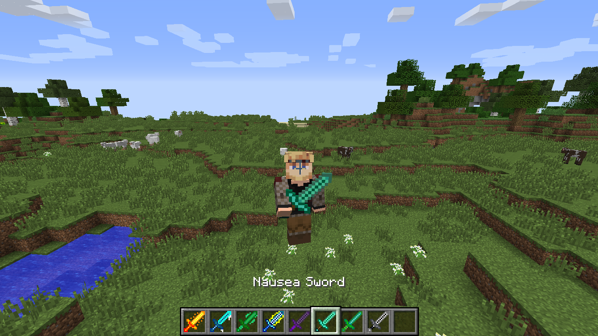

**Efeito:** Causa náusea no inimigo, distorcendo a tela por alguns segundos.

---

### 🍖 Hunger Sword

**Efeito:** Aplica fome no inimigo, esgotando rapidamente a barra de comida.

---

### 🛡️ Weakness Sword

**Efeito:** Reduz o dano causado pelo inimigo por alguns segundos.

---

## ⚙️ Versão compatível

- Minecraft **1.7.10**
- Minecraft Forge **1.7.10 – 10.13.4.1614**

---

## 🛠️ Instalação

1. Instale o **Minecraft Forge** para a versão **1.7.10**
2. Baixe o arquivo `.jar` do mod
3. Coloque o arquivo na pasta `mods` do seu Minecraft
4. Inicie o jogo e aproveite!

---

## 🔨 Receitas (Crafting)

Fire Sword

**Ingredientes:**
- 2 varas de blaze
- 1 graveto

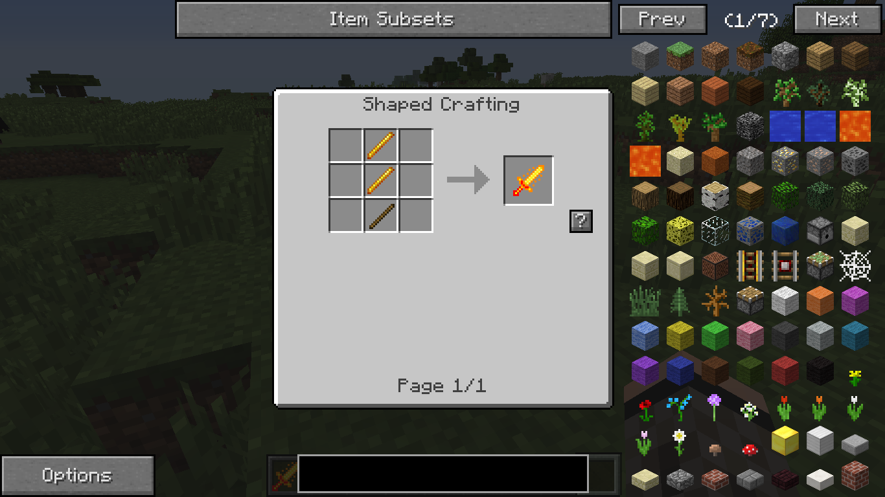

 

Ice Sword

**Ingredientes:**
- 2 blocos de gelo
- 1 graveto

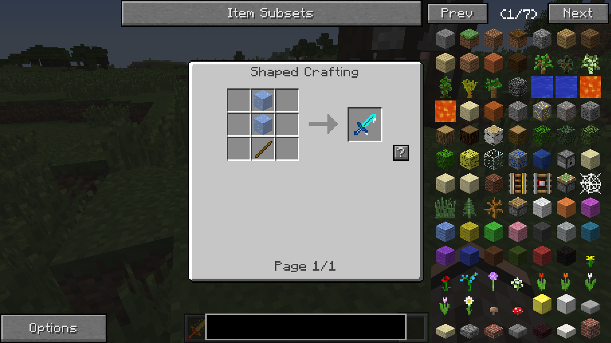

 

Poison Sword

**Ingredientes:**
- 2 olhos de aranha
- 1 graveto

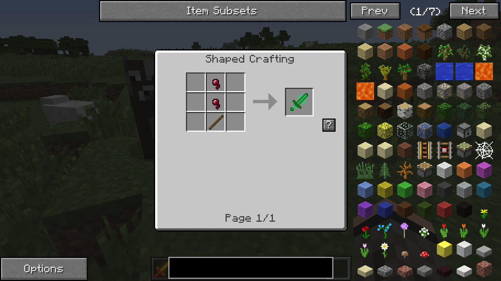

 

Lightning Sword

**Ingredientes:**
- 1 barra de ferro
- 1 barra de ouro
- 1 graveto

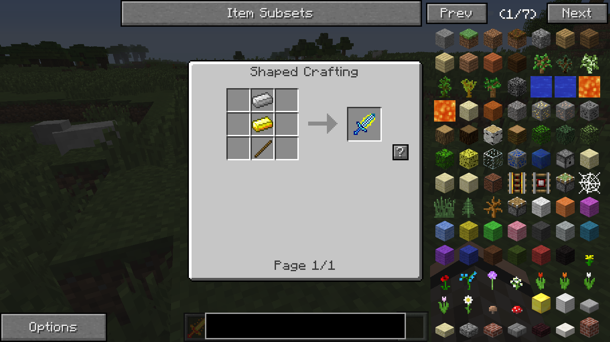

 

Wither Sword

**Ingredientes:**
- 2 carvões
- 1 graveto

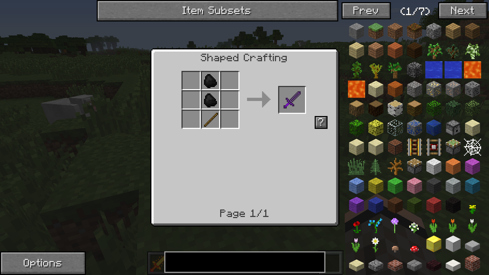

 

Nausea Sword

**Ingredientes:**
- 2 carnes podres
- 1 graveto

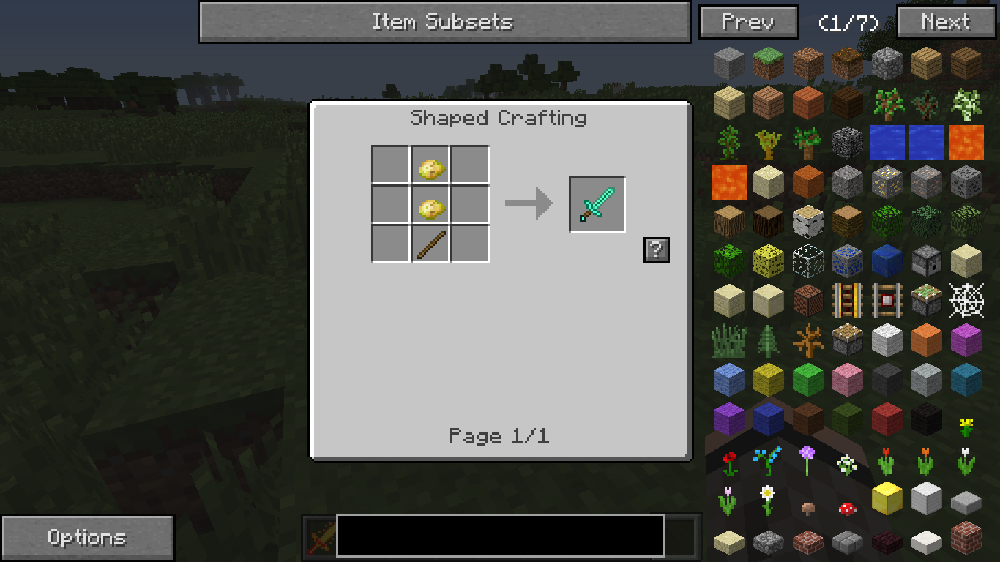

 

Hunger Sword

**Ingredientes:**
- 2 batatas podres
- 1 graveto

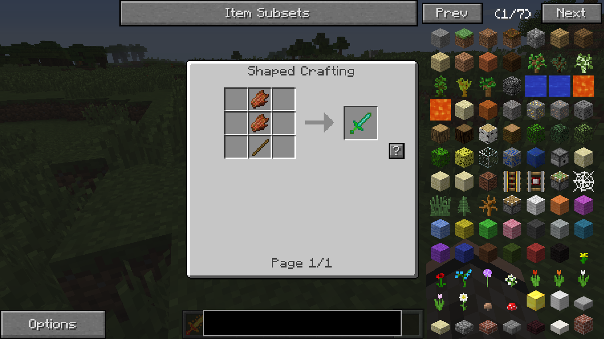

 

Weakness Sword

**Ingredientes:**
- 2 ossos
- 1 graveto

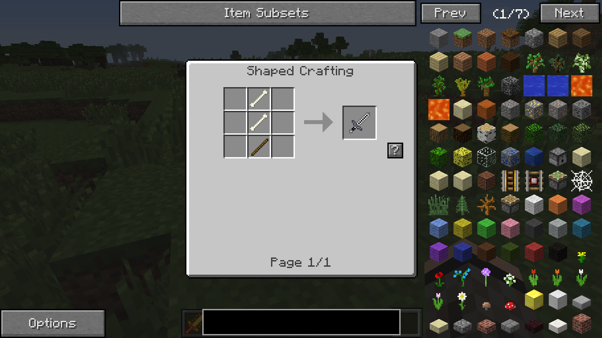

 

## 📝 Licença

Este mod é de uso livre para fins pessoais. Não retribua sem autorização.