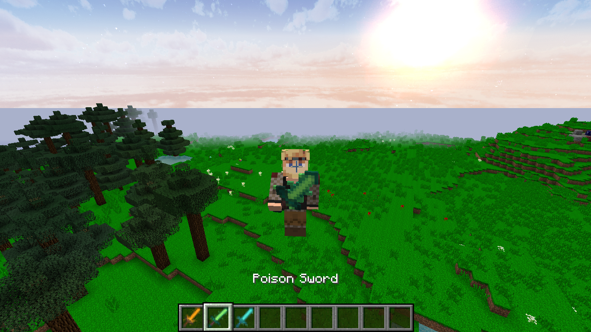

# ExtraSwords – Minecraft 1.7.10

Mod para **Minecraft 1.7.10** que adiciona espadas elementais mantendo o visual, proporções e lógica do jogo vanilla.  
O foco é expandir o combate com efeitos simples, diretos e coerentes com a versão.

---

## 📦 Itens

### 🔥 Fire Sword

**Efeito:** Causa combustão no inimigo por alguns segundos.  
 
 

### 🧪 Poison Sword

**Efeito:** Aplica efeito de veneno no alvo.

 

### ❄️ Ice Sword

**Efeito:** Reduz a velocidade de movimento do inimigo.  

---

## ⚙️ Versão

- Minecraft **1.7.10**
- Forge **1.7.10**

---

## 🛠️ Instalação

1. Instale o Minecraft Forge para a versão **1.7.10**
2. Baixe o arquivo `.jar` do mod
3. Coloque o arquivo na pasta `mods` do seu Minecraft
4. Abra o minecraft e veja se não há nenhum erro.

---

## 📜 Receitas (Crafting)

*Em breve*

---

## 📝 Licença

Este mod é de uso livre para fins pessoais. Não redistribua sem autorização.